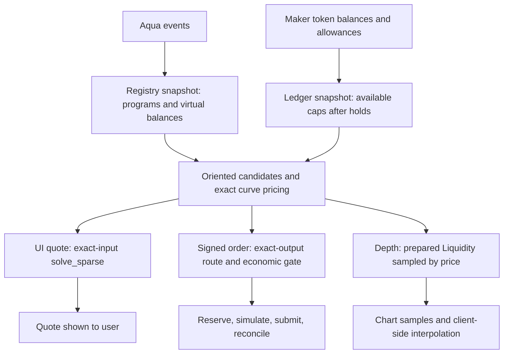
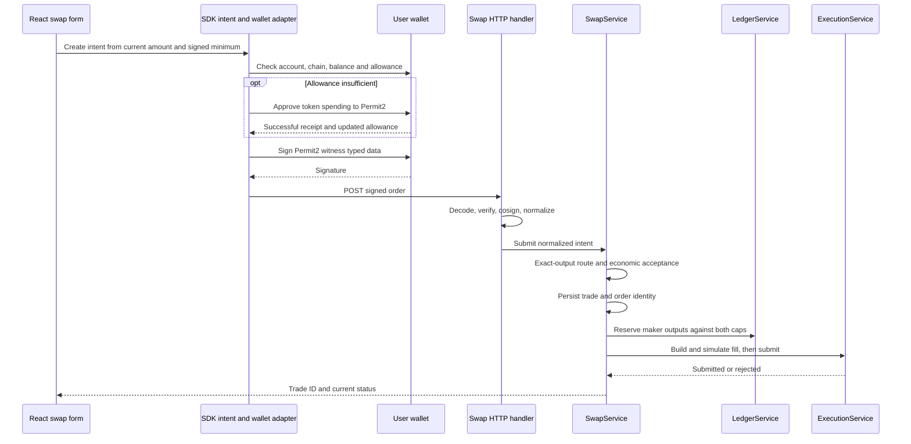
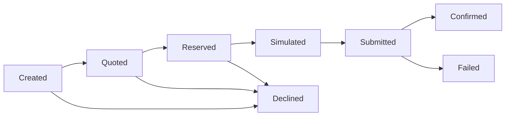

# Solvent water-fill: from first principles to debugging a live trade

**Code snapshot:** 9 September 2026, the working tree based on commit `f06a05a`, including the uncommitted depth/routing audit. This guide describes that implementation. Names, constants and behavior below come from the source, including places where older comments or planning documents describe an earlier version.

The algorithm's name is **water-fill**. The implementation is `waterfill.rs`; “water flow” and “waterfall” in our discussions refer to this routing work. It decides how much to trade with each maker strategy. It does not itself move tokens, sign orders or pay gas.

This guide has three layers: understand the economics, follow the implementation, and diagnose failures. The continuous equations explain the idea; the Rust code determines integer amounts and executable behavior. An illustrative calculation is explicitly labeled when it omits fees, rounding or caps.

## How to study this guide

| Your objective | Read first | You should be able to explain afterward |
| --- | --- | --- |
| Understand a swap without calculus | Sections 1–5 | Why a trade may use several strategies and why a quote is not a settlement |
| Understand the mathematics | Sections 6–9 | Marginal price, λ, fee transformation, caps and bisection |
| Read the current implementation | Sections 10–15 | Candidate selection, exact-in/out assembly, sparse routing and depth |
| Follow a real trade end to end | Sections 16–18 | Approval, signature, reservation, simulation, execution and confirmation |
| Debug independently | Sections 19–23 | Isolate the failing layer, reproduce a book and choose the right test |

Keep a notebook with four columns while reading: **quantity, unit, source, meaning**. Most difficult routing bugs begin with confusing two quantities that happen to have the same Rust type.

### Chapter links

- [1. The problem we are solving](#1-the-problem-we-are-solving)
- [2. Three paths that share mathematics](#2-three-paths-that-share-mathematics)
- [3. Units: master these before the equations](#3-units-master-these-before-the-equations)
- [4. Four prices with different jobs](#4-four-prices-with-different-jobs)
- [5. A complete small numerical example](#5-a-complete-small-numerical-example)
- [6. The optimization problem and the water level](#6-the-optimization-problem-and-the-water-level)
- [7. The three curve families](#7-the-three-curve-families)
- [8. Fees and exact rounding](#8-fees-and-exact-rounding)
- [9. Shared liquidity and wallet limits](#9-shared-liquidity-and-wallet-limits)
- [10. Candidate selection: before water-fill begins](#10-candidate-selection-before-water-fill-begins)
- [11. Walking through `solve` in `waterfill.rs`](#11-walking-through-solve-in-waterfillrs)
- [12. Gas-aware sparsity and acceptance](#12-gas-aware-sparsity-and-acceptance)
- [13. Depth preparation: `Liquidity` and `WalletBoundary`](#13-depth-preparation-liquidity-and-walletboundary)
- [14. Turning a frontier into the depth API](#14-turning-a-frontier-into-the-depth-api)
- [15. What the chart actually represents](#15-what-the-chart-actually-represents)
- [16. From Swap click to submitted trade](#16-from-swap-click-to-submitted-trade)
- [17. From plan to on-chain settlement](#17-from-plan-to-on-chain-settlement)
- [18. Lifecycle, clocks and identifiers](#18-lifecycle-clocks-and-identifiers)
- [19. A systematic debugging procedure](#19-a-systematic-debugging-procedure)
- [20. Read-only API labs](#20-read-only-api-labs)
- [21. Numerical and test labs](#21-numerical-and-test-labs)
- [22. Performance: understand what is expensive](#22-performance-understand-what-is-expensive)
- [23. What an expert should check before changing this algorithm](#23-what-an-expert-should-check-before-changing-this-algorithm)
- [Source-code map](#source-code-map)

## 1. The problem we are solving

A taker wants to exchange DAI for USDC. Several maker strategies can sell USDC for DAI. Each strategy has its own price curve, fee and available output. The resolver must decide how much to buy from each strategy.

Sending everything to the strategy with the best initial price is often wasteful. Trading against that strategy changes the price of its next unit. Another strategy can become cheaper before the order is complete. Splitting the order can reduce this price deterioration.

The basic question is:

> Given this pair, this amount, these curves and these spending limits, which per-strategy amounts give the best exchange?

The production question adds more requirements:

> Does the exchange satisfy the signed order, leave enough economic margin for estimated execution gas, fit the maker wallets after other reservations, and survive transaction simulation?

These are separate questions, handled by separate components.

### The actors

| Actor or object | Responsibility |
| --- | --- |
| Taker / swapper | The user exchanging tokens and signing an order |
| Maker | A wallet offering liquidity through strategies |
| Strategy / position | One shipped program and its virtual balances; identified by strategy hash |
| Candidate / venue | One eligible strategy oriented for a particular input token and output token |
| Route leg | The amount assigned to one candidate |
| Resolver | The backend choosing, reserving and submitting a route |
| Aqua | Shared-liquidity accounting and pull/push machinery used by maker positions |
| SwapVM router | Executes the maker's program and its curve/fee instructions |
| UniswapX reactor | Validates the taker's order and settles its input and outputs |
| Filler contract | Executes the backend's selected source swaps inside the reactor callback |

A maker can have several strategies for the same pair. Three strategy legs do not necessarily mean three distinct makers. Our depth response counts distinct makers; the current quote response's `makers_sourced` is computed from the number of legs. Read the field's producer before treating it as a unique-wallet count.

## 2. Three paths that share mathematics



| Path | Question | Entry | Reserves liquidity? | Gas role |
| --- | --- | --- | --- | --- |
| Quote | What output can this input source now? | `QuoteService::quote` | No | Estimated per-leg gas influences leg removal |
| Signed swap | Can we deliver the signed minimum within the signed input budget? | `SwapService::submit` → `route` | Yes, after routing | Gas also participates in the economic acceptance check |
| Depth | How much liquidity can be sourced at progressively worse execution prices? | `DepthService` → `Liquidity` | No | No gas profitability threshold or sparse execution selection |

Depth uses the same curve pricing, fees and cap information. It is not a sequence of live swap submissions. The plotted frontier can use all eligible pair positions, while the execution router selects a bounded candidate set and may remove legs to save gas. Therefore the graph and a quote need not give identical amounts.

## 3. Units: master these before the equations

Token amounts are integers in the token's smallest unit, or **atoms**. Decimal places tell the UI how to render those integers.

| Human amount | Decimals | Raw amount |
| --- | ---: | ---: |
| 2.5 DAI | 18 | 2500000000000000000 |
| 2.5 USDC | 6 | 2500000 |
| 1 WBTC | 8 | 100000000 |

If `raw_out / raw_in` is the raw price, then:

```text
human output-per-input price
    = (raw_out / raw_in) × 10^(input_decimals - output_decimals)
```

For a human DAI/USDC price of one USDC per DAI, the raw output/input ratio is `10^-12`. A λ near `10^-12` is normal for this orientation; it is not proof that the price collapsed.

Reversing a trade changes input/output, decimals, reserves and fees' effect on the input. Do not reverse a finite-trade quote by taking its reciprocal. Even when the initial infinitesimal prices are reciprocals, finite execution changes reserves and includes rounding.

There are also **two different percentage scales**:

- Conventional basis points: 10,000 = 100%. Depth's impact ladder and the frontend slippage calculation use this scale.
- SwapVM flat-fee encoding: 1,000,000,000 = 100%. Despite `fees_in_bps` in the name, a value of `3_000_000` means 0.3%, not three million conventional basis points.

The denominators differ by 100,000; confusing them is a scale error, not a small rounding difference. Always write the denominator beside an encoded percentage.

## 4. Four prices with different jobs

For a venue receiving input `x` and delivering output `F(x)`:

| Quantity | Formula / meaning | Where it matters |
| --- | --- | --- |
| Initial marginal price | `F′(0)`, the rate for an infinitesimal first unit | Which venue starts attractive; depth's tip |
| Marginal price after input x | `F′(x)`, what the next tiny unit buys | Water-fill allocation |
| Average / effective price | `F(x) / x` | Total execution quality and tooltip |
| Signed minimum | A required output amount, not a price by itself | Order acceptance and settlement |

A fifth number, an external USD price, is used for gas conversion and valuation. It does not replace the strategy's invariant when computing a maker swap.

On a diminishing-return curve, the initial marginal price exceeds the average price, and the average price exceeds the final marginal price. Imagine buying apples from a seller whose price rises after each apple: the last apple's rate is different from your average rate for the basket.

### Price impact versus slippage

**Price impact** measures the exchange-rate deterioration caused by the size of a trade against the available curves. **Slippage tolerance** is the user's permitted gap between the displayed quote and the minimum they sign. It accommodates changes and, in our current flow, leaves room from which the resolver may source its spread.

Zero displayed impact does not mean execution costs zero. A rounded `0.00%` also does not mean an exactly zero mathematical difference.

## 5. A complete small numerical example

This example uses continuous arithmetic, equal token decimals, no fee, no wallet binding and two constant-product strategies. It teaches the allocation; later sections restore integer behavior.

| Strategy | Input reserve R | Output reserve S | Initial rate S/R |
| --- | ---: | ---: | ---: |
| A | 1,000 | 1,000 | 1 |
| B | 2,000 | 2,000 | 1 |

The user wants to spend 300 input tokens.

For a constant-product strategy:

```text
output(x) = S × x / (R + x)
```

Three possible allocations are:

| Input to A | Input to B | Total output |
| ---: | ---: | ---: |
| 300 | 0 | 230.769231 |
| 150 | 150 | 269.969666 |
| 100 | 200 | 272.727273 |

Why is 100/200 better? B has twice the depth. A trade of 100 against A moves its reserves by the same proportion as 200 against B. Their final marginal prices then match:

```text
A: 1,000,000 / 1,100² = 0.826446281
B: 4,000,000 / 2,200² = 0.826446281
```

Their average execution price is `272.727273 / 300 = 0.909090909`. Their final marginal price is `0.826446281`. These are both correct and answer different questions.

If one uncapped venue's next unit gives more output than another's, shifting a small amount toward the better venue improves the total. At the continuous optimum, that improvement disappears because the free active venues have the same marginal price.

## 6. The optimization problem and the water level

For exact input `X`, ignoring integer atoms and fixed per-leg gas for a moment, the allocation solves:

```text
maximize       Σ F_i(x_i)
subject to     Σ x_i = X
               x_i ≥ 0
               F_i(x_i) ≤ strategy output cap_i
               Σ F_i(x_i), over one maker's strategies, ≤ maker wallet cap
```

Here `i` indexes strategies, not necessarily different wallets. Each `F_i` includes that strategy's input fee.

The familiar continuous routing problem can be handled using convex optimization under appropriate curve assumptions; adding fixed costs for choosing venues introduces discrete choices. That distinction is established in [Optimal Routing for Constant Function Market Makers](https://arxiv.org/abs/2204.05238). Our implementation uses bounded searches and heuristics rather than a general global mixed-integer optimizer.

### What λ means

λ, pronounced “lambda,” is a candidate common **marginal output-per-input rate**. Ask each venue:

> How much input can you accept while your next unit still gives at least λ output?

Raise λ and the requirement becomes stricter, so venues fill less. Lower λ and they fill more. This gives a monotone search function.

The price-decomposition idea is related to the independent venue subproblems described in [CFMMRouter's solution method](https://bcc-research.github.io/CFMMRouter.jl/dev/method/). Our single-pair solver bisects one scalar level; CFMMRouter describes a more general network formulation and dual optimizer. They are not the same implementation.

For free, active, uncapped venues the continuous condition is `F_i′(x_i) = λ`. Boundary conditions matter:

- An unused venue may start at a marginal rate below λ.
- A venue stopped by its cap may still offer a rate above λ, because no more can be sourced from it.
- A shared-wallet constraint can pin all that maker's positions at a higher group-specific level.
- Integer rounding and the Pegged numerical marginal introduce residual differences.

These conditions are the relevant part of the **Karush–Kuhn–Tucker (KKT)** idea: optimality includes the constraints, not just equality of every displayed rate. A test that demands identical marginal prices from capped, unused and freely active venues is testing the wrong property.

For exact output `Y`, the dual viewpoint is to minimize `Σ C_i(y_i)` subject to `Σ y_i = Y`, where `C_i` is the input required for output `y_i`. Away from rounding, `C_i′(y_i) = 1/F_i′(x_i)`. The same water-level machinery can therefore serve both directions.

## 7. The three curve families

The `Pricing` trait provides three operations:

```text
quote_exact_in(input)          → output
quote_exact_out(output)        → required input
quote_with_limit(input_bound, λ) → a partial input/output fill
```

The last is a solver operation. Its price limit is not the user's signed slippage bound.

### 7.1 Full-range XYC

Let `R` be the input reserve and `S` the output reserve. The exact Rust operations are:

```text
exact input:  floor(x × S / (R + x))
exact output: ceil(y × R / (S - y)), requiring y < S
```

Both reserves must be positive. The products and sums intentionally reproduce checked Solidity arithmetic. A mathematically finite fraction can still reject if the contract's intermediate multiplication overflows.

In the continuous model:

```text
F′(x) = R × S / (R + x)²
x(λ)  = sqrt(R × S / λ) - R
```

`XycPool::quote_with_limit` floors the square root, clamps the input to its bound, and prices the result exactly. A zero λ means no marginal-price floor. A λ at or above the initial rate produces no fill. If the analytical boundary lies beyond U256, the code uses the finite input bound and validates that quote; it does not manufacture an unbounded amount.

### 7.2 Concentrated XYC

Concentrated strategies transform the committed reserves into amplified mathematical reserves, then use XYC pricing. The physical output limit still comes from the wallet and position caps.

In a continuous explanation, with canonical lower-address reserve `x`, higher-address reserve `y`, and square-root bounds `s_min`, `s_max`:

```text
α = 1 - s_min / s_max
β = x × s_min + y / s_max
L = (β + sqrt(β² + 4αxy)) / (2α)
effective lower-address reserve  = x + L / s_max
effective higher-address reserve = y + L × s_min
```

The code uses a `10^18` square-root-price scale and direction-specific floor/ceil operations. `concentrate_liquidity` and `ConcentratePool::grow_reserves` are authoritative for exact arithmetic. Token-address ordering, not the UI's base/quote label, determines canonical orientation.

Do not confuse two uses of “virtual”: the position's Aqua accounting balance is one constraint; the amplified reserves constructed for concentrated pricing are mathematical curve state. Amplification does not create spendable tokens.

The amplified pool is prepared once in `ConcentratePool`, stored as `Result<XycPool, CurveError>`, and reused during the solve. This avoids repeating square-root preparation for every bisection probe while preserving a preparation failure.

### 7.3 Pegged

The Pegged curve normalizes balances using the program's rates and initial coordinates. In dimensionless continuous notation its invariant is:

```text
C = sqrt(u) + sqrt(v) + a × (u + v)
```

`linear_width` represents `a` in the fixed-point implementation. Increasing the linear contribution makes part of the behavior closer to a constant-sum exchange; it does not eliminate inventory limits or turn the whole curve into an unlimited one-to-one exchange.

Given new input coordinate `u`, solving for `v` means:

```text
r = C - sqrt(u) - a × u
sqrt(v) + a × v = r
```

Put `w = sqrt(v)`. Then `a w² + w - r = 0`. The stable positive-root form is:

```text
w = 2r / (1 + sqrt(1 + 4ar))
v = w²
```

At `a = 0`, `v = r²`. A negative `r` is infeasible. Rust implements this with `10^27` fixed-point coordinates, checked operations and specific square-root rounding in `pegged_solve`.

Exact-in/out amounts use that analytical root. However, **the fill at a marginal-price limit uses numerical search**, inherited from `Pricing`:

1. Find a feasible input bound.
2. Set a finite-difference step to `max(bound / 1_000_000, 1 atom)`.
3. Estimate the marginal as `(F(x + step) - F(x)) / step`.
4. Bisect input until the estimate reaches the requested limit.

That numerical marginal is an approximation even though each `F(x)` call uses exact integer quote arithmetic. Pegged is consequently more expensive per solver probe than closed-form XYC. Its spot marginal used by depth is computed separately from the normalized invariant weights.

Normalized reserves and the invariant are prepared once per pool instance. This is snapshot-local reuse, not a cross-request cache of old prices.

## 8. Fees and exact rounding

Let `D = 1_000_000_000`, and let `f` be one encoded input fee.

```text
shrink(a, f) = a - ceil(a × f / D)
gross(a, f)  = a + ceil(a × f / (D - f))
```

For multiple fees, exact-in applies shrinking in program order. Exact-out reverses that sequence and grosses up. Reversing the order matters when integer rounding is involved.

The continuous retained fraction is:

```text
γ = product over fees of (1 - f / D)
F_gross(x) ≈ F_curve(γx)
F_gross′(x) ≈ γ × F_curve′(γx)
```

Thus `Candidate::net_quote_with_limit` converts the requested gross-input marginal λ to the fee-free curve's limit `λ/γ`, shrinks the gross input bound, calls the curve, then grosses up the consumed input. Final leg construction recomputes exact amounts; it does not simply multiply a floating-point γ into the answer.

At or above a 100% fee, the candidate's γ is invalid. Debug the fee encoding rather than compensating with a larger input bound.

### The exact-out round-trip trap

Consider an integer XYC with `R=3`, `S=1000`, and an output cap of 10 atoms:

```text
exact_out(10) = ceil(10 × 3 / 990) = 1 input atom
exact_in(1)  = floor(1 × 1000 / 4) = 250 output atoms
```

These operations are consistent: one input atom is enough to buy at least 10 output atoms, but an exact-input swap gives 250. Using `exact_out(cap)` blindly as an exact-input ceiling would breach the cap.

`input_within_output` checks the round trip and steps back one input atom when it overshoots. In this example that ceiling is zero. An exact-output execution can still request exactly 10 for one input atom. The depth preparation/assembly retains this kind of executable exact-output capacity.

Never assume `exact_in(exact_out(y)) == y`. The useful relationship is usually “enough output,” with contract arithmetic and feasibility determining the actual boundary.

## 9. Shared liquidity and wallet limits

Candidate construction separates price shape from availability:

```text
wallet available = synced pullable wallet budget, net of ledger holds
position available = synced strategy virtual budget, net of ledger holds
candidate.cap_out = min(wallet available, position available)
candidate.wallet_cap = wallet available
```

The adapter's maker wallet budget is `min(ERC20 balance, allowance to Aqua)`. The strategy virtual budget comes from the active strategy's registry state. These are output-token budgets for the requested direction.

Precisely, the current ledger computes `available = max(budget - (pending + consumed), 0)`, using saturating arithmetic. `pending` represents outstanding reservations; `consumed` records posted fills. Posting moves the actual filled quantity into `consumed` and returns only the unused reservation remainder. A budget refresh replaces the external budgets but does not clear these compartments. When diagnosing availability lower than a fresh chain balance, inspect **all three numbers**, including whether the refreshed budget already reflects a debit still represented in `consumed`. Do not assume the available snapshot equals chain balance minus pending orders alone, or that a refresh automatically rebases posted consumption.

Suppose one maker ships two positions, each advertising 1,000 USDC, but the wallet can supply only 100 USDC. Each candidate's individual cap is 100. Summing those individual caps and announcing 200 USDC is wrong: both positions use the same 100-USDC wallet.

The constraint is `output_A + output_B ≤ 100`, and holds from concurrent intents consume this budget too. Position detail pages may each show what that position can supply in isolation; those capacities are not independently additive.

### The wallet floor

For strategies belonging to one maker, find the marginal level at which their combined output fits the wallet. Call it `wallet_floor`. A leg then fills at:

```text
effective_level = max(global_λ, wallet_floor)
```

If the global price would ask too much of the wallet, its higher floor holds the maker back. Other makers may continue filling as global λ decreases.

Illustration: two identical 1,000/1,000 XYC curves share a 100-output wallet. The continuous allocation delivers 50 from each, costing about 52.631579 input each. Their common marginal is `(950/1000)² = 0.9025`. Below that level, further global demand cannot make this wallet supply more than 100.

`MakerGroups` builds stable maker groups once and records each leg's group. This grouping is valid because a solve handles one input/output direction. If extending the solver to several output tokens at once, grouping by maker alone would be insufficient; budgets are keyed by maker **and token**.

## 10. Candidate selection: before water-fill begins

`select` builds candidates from active strategies for the pair. `build_candidate` excludes unsupported programs, empty reserve sides and zero deliverable caps. A strategy being visible in a UI does not imply it is currently a routable candidate.

The execution selector scores candidates as follows:

| Request direction | Score | Preferred score |
| --- | --- | --- |
| Exact input | `net_quote_exact_in(request.amount)` | Larger output |
| Exact output | `net_quote_exact_out(min(request.amount, cap_out))` | Smaller input |

A scoring failure sorts behind a priceable candidate; it does not necessarily remove the candidate if room remains in the selected set. Quickselect retains the top `max_candidates`, then sorts that set deterministically, using strategy hash to break score ties.

Current application constants are **16 candidates** and a **best-effort four-leg target**. These are different controls. Raising the leg target cannot recover a venue that candidate selection already discarded.

Ranking is a heuristic. An exact-in whole-size score does not encode the venue's capacity, and exact-out scores can compare different capped output sizes. Neither establishes that the selected subset contains the globally optimal allocation. The omitted-spot warning is a useful hint that the candidate limit is too small, not a certificate of optimality or a completeness test for all missed routes.

Depth does not use this top-16 selection: pair depth builds all eligible candidates and sorts by strategy key; position depth directly builds its requested strategy.

## 11. Walking through `solve` in `waterfill.rs`

The public solver receives frozen candidates, a `RouteRequest`, and an optional previous λ. It returns `Option<Split>`. `None` means this prepared solve did not produce a route; it does not uniquely identify “the wallet was empty.”

### Step 1 — prepare the Book

`Book::new` constructs per-leg input bounds and shared-wallet floors.

For exact input, the bound is limited by both the whole request and the candidate's output cap. For exact output below a cap, the bound can use a ceil-rounded input large enough to reach the target. When a cap binds, it uses the cap-safe direction described earlier. If direct inverse pricing fails, the existing checked feasibility search finds a usable input bound.

`Book::leg(i, λ)` fills at `max(λ, floor_i)`. A curve pricing error becomes a zero contribution (`NO_FILL`) in this step. That makes the solver resilient to one unusable venue, but can hide the original pricing reason behind a later `None`; inspect the candidate quote directly when debugging.

### Step 2 — measure maximum prepared capacity

`Book::measure(0)` fills at the lowest global price, still respecting wallet floors and input bounds. It sums input for exact-in and output for exact-out. If it is below the request's target, `solve` returns `None` immediately.

This is a feasibility check over the selected, prepared book. It is not proof that no route exists anywhere in the registry, especially when candidate truncation or coarse integer plateaus are involved.

### Step 3 — bracket the common price

`bracket_level` maintains:

```text
fill(lo) ≥ target      # lo allows enough filling
fill(hi) < target      # hi allows too little filling
```

It starts from zero and an upper price scaled to the book's largest positive fee-inclusive marginal. A nonzero warm seed may tighten the initial upper guess. If needed it returns to the book upper bound, then uses the finite extreme fallback `2 × U256::MAX` represented as a `Ratio`.

At each iteration:

```text
mid = (lo + hi) / 2
if fill(mid) ≥ target:
    lo = mid
else:
    hi = mid
```

For the 300-input example, λ values near 0.75 allow about 464.10 input, while 0.875 allows about 207.13. The solution lies between them and converges near 0.826446281.

The search stops after at most **128 iterations**, or when the difference between endpoint fills is at most:

```text
max(target / 1_000_000, 1 atom)
```

That is a tolerance in the **target amount**, not a fixed number of decimal places in λ, and not a universal bound on economic regret. Exact rational midpoint arithmetic prevents floating-point ordering drift but does not remove integer plateaus or guarantee convergence to a unique allocation.

The application passes `None` for the initial quote/swap warm seed. `solve_sparse` does reuse the previous split's λ while trying a smaller venue set. There is no persistent pair-level λ cache in these callers today.

### Step 4a — exact-input assembly

`assemble_exact_in` starts from the under-filling `hi` side. It calculates the remainder and repeatedly allocates room to the leg offering the largest additional output for that remainder, respecting its box bound and remaining shared-wallet room. Strategy hash breaks gain ties.

This is a bounded numerical correction, not a second global optimizer. Wallet-pinned books may strand a small sliver of input rather than violate a wallet cap. The property tests check that the spent input is at most the request and within `max(target/1_000_000, 1)` of it for their generated books. Inspect actual `split.amount_in`; do not assume it always equals the requested integer exactly.

### Step 4b — exact-output assembly

`assemble_exact_out` starts from the reaching `lo` side, then trims the excess output. The logical trim priority is largest output first, with strategy-hash ties. The implementation retains amounts in reverse priority against a remaining target, so even an unrepresentable aggregate sum cannot conceal an excess.

It then recomputes the input needed for every retained output. Exact-output is the direction the filler actually executes.

### Step 5 — build the Split

`build` recomputes the other side of each leg using exact pricing, excludes zero-input or zero-output dust legs, and adds final amounts with checked arithmetic. A quote error or aggregate overflow returns `None`; an empty leg set also returns `None`.

`Split` contains legs, input/output totals and λ. Its totals are raw token amounts. The `net_output` and `gross_input` accessors apply the provided per-leg gas estimate; gas is not baked into the stored totals.

### Three arithmetic policies, three purposes

| Policy | Appropriate use in this implementation | Do not substitute it for |
| --- | --- | --- |
| Checked U256 arithmetic | Contract-compatible quote operations and representable final leg totals | Arbitrary widening that would accept a contract revert |
| Saturating U256 arithmetic | Bounded comparisons, nonnegative remaining room and net/gross estimates | Detecting whether several outputs exceed a U256-sized wallet |
| Arbitrary-precision `Ratio` | Price comparisons, midpoint search and analytical inversion | Permission to return token amounts larger than U256 |

For example, a saturating sum of outputs becomes U256::MAX whether the true sum is exactly that value or exceeds it. Comparing that sum to a wallet of U256::MAX cannot detect the second case. `exceeds_budget` instead subtracts each output from the remaining budget and rejects the first underflow. Final `build` totals use checked addition, because an unrepresentable aggregate cannot be encoded as an honest token amount.

## 12. Gas-aware sparsity and acceptance

### Why fewer venues can be better

A third venue might improve raw output by 0.02 USDC but add 0.15 USDC of estimated execution cost. The extra leg loses economically even though it improves the fee-adjusted token exchange.

`solve_sparse` first solves with all selected candidates, then repeatedly:

1. Selects the smallest-output active leg, with a stable hash tie-break.
2. Removes its candidate and solves the smaller book, warm-started by the current λ.
3. Keeps the removal if it is feasible and either improves/ties gas-adjusted economics or is needed to reach the configured leg target.
4. Otherwise restores that candidate and stops.

It does not try every alternative removal after the first rejected one, nor every possible venue subset. If a smaller book cannot fill the trade, it retains the last feasible split even when it has more than `max_legs`. The source behavior takes precedence over a field comment that sounds like a hard cap.

### Gas units and gas cost are different

Ignoring fixed-point conversion details:

```text
native gas = gas_units_per_leg × gas_price_wei / 10^18
USD gas = native gas × native_token_USD_price
spread-token gas = USD gas / spread_token_USD_price
raw per-leg cost = floor(spread-token gas × 10^spread_token_decimals)
```

For 150,000 gas at 20 gwei and native price $3,000, the estimate is $9 per leg. For a $1 token with six decimals, that is 9,000,000 atoms. These are illustrative prices, not current market data.

The **spread token** is output for exact-in and input for exact-out. `LegCostResolver` reads cached prices and gas. If inputs are unavailable it returns zero cost; that is a fallback, not evidence that gas is free. The estimate uses a configured per-leg gas amount, not the exact receipt cost, and does not by itself establish the operator's native-wallet balance.

`route` applies these acceptance conditions:

```text
exact-in:  split output - estimated leg gas ≥ signed minimum output
exact-out: split input + estimated leg gas ≤ signed maximum input
```

The arithmetic uses saturating net/gross accessors followed by checked subtraction. At the ordinary non-overflowing boundary, equality is accepted: the code does not require a strictly positive extra profit margin.

### Why the quote can succeed and the signed order fail

The quote endpoint solves exact input and uses gas when choosing legs. It returns the raw sourced output, **not that output minus gas**. It has no user-signed minimum and does not run `route`'s signed-bound profitability check.

The frontend signs `floor(quoted_output × (1 - slippage))`. Submission solves exact output for that minimum and charges input-denominated gas against the user's input budget. Curves, caps and gas may also change between the two requests.

An idealized stable, one-to-one example with 0.5% slippage and 0.15 input-token gas:

| User input | Signed minimum | Input to source minimum | Plus gas | Accepted within user input? |
| ---: | ---: | ---: | ---: | --- |
| 2.5 | 2.4875 | 2.4875 | 2.6375 | No |
| 75 | 74.625 | 74.625 | 74.775 | Yes |

With these simplifying assumptions the break-even input is `gas / slippage_fraction = 0.15 / 0.005 = 30`. There is **no universal minimum trade size**: maker fees, curves, reserve changes, leg count, gas and signed tolerance alter it. This example explains the failure class, not the exact historical reason for a particular trade without its recorded inputs.

The on-chain filler pays the user the signed order's required output and retains token spread. The operator pays native gas separately. A nondecreasing token-balance guard in the filler is not an on-chain guarantee of positive profit after native gas.

## 13. Depth preparation: `Liquidity` and `WalletBoundary`

`Book` answers a target-sized trade. `Liquidity` answers many marginal-price queries against the same frozen book. Keeping their responsibilities separate is the main performance design.

`Liquidity::new` performs the reusable work:

1. Compute every candidate's `full_input_bound`. Try inverse pricing at the output cap, then one output atom below it; if neither works, use checked feasibility search across the representable range.
2. Find each candidate's full output at λ=0, bounded by its output cap.
3. Choose the highest positive initial marginal among candidates that can deliver a nonzero prepared output. An empty venue must not anchor the chart's price.
4. Group positions by maker and check their combined output against the shared wallet.
5. For an over-budget group, bracket its wallet level, take the reaching allocation, and trim exact outputs to the wallet budget.
6. Compare that group allocation against eligible single-leg endpoints. Whole-atom input costs can make a one-leg fill cheaper. Keep a cheaper endpoint, with deterministic selection among equal-cost endpoint candidates.
7. Store the resulting group threshold and `(candidate index, output)` allocations as `WalletBoundary`.

The endpoint comparison is bounded work during preparation. It is not an exhaustive search of integer partitions. Scratch output storage is allocated once; each group processes its own indices rather than scanning the entire candidate set repeatedly.

`Liquidity::at_price(λ)` then does much less work. For a group pinned by its wallet threshold it reuses the prepared outputs. For other candidates it computes their outputs at λ. Finally it builds an exact-output `Split`, using the same exact curve/fee functions as routing.

This preparation lasts for one depth computation. A later HTTP request builds from a fresh snapshot read. The optimization removes repeated work inside a request without introducing a persistent stale-price cache.

### Why depth and `solve` have different wallet handling

`Book` uses an under-budget price floor while finding a specified total input or output. `Liquidity` must retain useful wallet-limited capacity across many prices, including coarse cases where a price jump would otherwise discard an entire group's output. It caches a trimmed reaching allocation and performs endpoint polishing.

They share constraints and pricing primitives, but they are not promised to return identical discrete allocations for every tiny book. Tests compare their economics and invariants within relevant tolerances. Do not “deduplicate” these two paths into one function merely because both mention a wallet floor; first preserve the distinct contracts.

## 14. Turning a frontier into the depth API

`DepthService::direction` resolves the display base and quote using the asset catalog:

- `sell`: input = base, output = quote.
- `buy`: input = quote, output = base.

Both API endpoints accept this direction, defaulting to sell when omitted. A canonical pair's address order and its display order are separate concepts.

`Sweep::curve` obtains a positive executable best price, then a ceiling split at λ=0. It samples an impact ladder of **10, 50, 100, 200, 500 and 1000 conventional bps**: 0.1%, 0.5%, 1%, 2%, 5% and 10%.

For each requested impact, `size_for_impact` searches marginal price from zero to twice the best price. At every probe it calls prepared `Liquidity::at_price`, measures the resulting **average execution impact**, and narrows the bracket. It returns the reaching side, so the returned impact is an achieved sample and can differ slightly from its nominal tier.

```text
average rate = total output / total input
impact bps = floor((best rate - average rate) / best rate × 10,000)
```

Depth clamps this impact to zero when the average rate is not below the best. It does not interpret a rounding improvement as negative impact.

Each tier search stops after 48 steps or when the input-size bracket is within `max(reached_input / 10_000, 1 atom)`. This **depth size tolerance** differs from the trade solver's one-part-per-million fill tolerance and the curve helper's one-part-per-trillion input precision.

The ladder stops at the first impact the full prepared capacity cannot reach. It sorts/deduplicates sizes, removes dominated smaller dust points, and retains increasing output. If a position exhausts its capacity before reaching the first tier, position depth can return that capacity point. Pair depth does not have this particular fallback. A positive best price with an empty pair ladder therefore needs more interpretation than “there is no token balance.”

Each point contains:

| Field | Meaning |
| --- | --- |
| `trade_size` | Cumulative raw input atoms |
| `output` | Cumulative raw output atoms |
| `effective_price` | Decimal-scaled average output per input, as a string |
| `impact_pct` | Achieved average-price impact in percent |
| `makers_used` | Distinct maker wallets in that sample |

An unknown position or pair without an active pool returns missing-resource behavior. A known position with no eligible executable candidate returns an empty curve. Invalid query parameters are a 400; admission overload is a 503. These cases should not all be diagnosed as arithmetic failures.

### Why whole atoms can break a smooth-looking assumption

Suppose a tiny trade rounds output down badly. A slightly larger trade may lose a smaller fraction to rounding and have a *better average rate*. Strictly worsening average price at every integer amount is not guaranteed by a smooth continuous invariant. Removing a dominated sample avoids drawing a misleading backwards ladder, but it is not proof of global discrete optimality.

## 15. What the chart actually represents

The current strategy chart reuses the pool depth component. It is a **current liquidity/depth visualization**, not price history, fills over time, a Binance candle chart, or a plot of the strategy's creation bounds alone.

The backend returns cumulative points `(input_j, output_j)`. The frontend converts raw amounts using token decimals, then calculates interval rates:

```text
segment rate_j = (output_j - output_(j-1)) / (input_j - input_(j-1))
```

Those are average rates over each additional segment—approximations to the marginal shape. `curvePoints` places them at segment midpoints and endpoints. D3 monotone interpolation draws through those points without creating artificial extrema between successive samples. It does not make the original sparse samples into exact prices at every possible input size.

The **hover dot** sits on the drawn geometry. The **tooltip price** integrates the segment rates up to the hovered input and reports the average execution price. Consequently, the dot's y-coordinate and the tooltip's price can differ. One shows the local segment-rate shape; the other describes the whole hypothetical trade. This difference is intentional.

At intermediate hover positions the amounts are interpolated estimates, not another backend quote. The maker count comes from the corresponding reached sample, not a fresh allocation at that exact pointer position. The curve's displayed total liquidity is the last accepted sampled input size; especially for a pair ladder it need not equal the absolute entire book capacity or the pool's USD TVL.

Non-finite, non-increasing or invalid samples are skipped. A missing price, very small token amount or empty chart should be checked in the raw API response before inspecting SVG coordinates. Numerical routing stays in integers/rationals; frontend `Number` conversion is for display and cannot preserve every atom of a huge U256 amount.

## 16. From Swap click to submitted trade



### Wallet prerequisites and the two prompts

The React hook owns mutation/UI state; the SDK intent owns authorization and retry state. The frontend converts the form amount with `parseUnits`, rounds slippage to conventional bps, and computes a raw minimum using integer division. Its current order TTL is 600 seconds.

`createWalletSession` checks the connected account/network and reads balance plus allowance at one block. If the allowance already covers the input it skips approval. If a nonzero allowance is too small, it resets to zero before setting the required amount, covering tokens that reject nonzero-to-nonzero approval changes. It waits for receipts and verifies the allowance actually changed.

The current SDK uses an **exact required allowance**, not a newly granted infinite allowance. It can reuse a sufficiently large existing allowance.

The first wallet prompt can be an ERC20 `approve` transaction. It changes allowance to **Permit2** and costs user gas. The next prompt signs `PermitWitnessTransferFrom` typed data, binding the token permission to order contents. That signature is not itself a mined swap transaction.

There are several different spenders in this system: user-to-Permit2 approval, maker-to-Aqua approval, filler-to-SwapVM temporary approval, and filler-to-reactor output approval. Comparing the wrong two addresses can look like a broken allowance flow when each is serving a different transfer.

### Authorization and retry identity

The order builder uses the upstream UniswapX SDK, flat base input/output amounts, a random nonce, reactor/Permit2/cosigner configuration, and the user as recipient. Ethers `BigNumber` values are converted to wallet-compatible typed-data JSON integers before signing.

The intent retains its signed payload across an ambiguous HTTP failure and shares in-flight work. Retrying the same intent therefore does not automatically ask for another signature or create a different order identity. A changed form/account/chain changes the React submission key. A definite decline permits a new attempt instead of indefinitely reusing a known declined result.

The server verifies the swapper signature using its configured Permit2 and chain, checks the named cosigner, adds its cosignature and normalizes the order. The current application swap path is request-driven. The separately implemented `IngestPipeline` is not a hidden prerequisite or background queue through which this HTTP request passes.

### Routing and persistence

`SwapService` obtains current input and first output amounts from the normalized order at the current timestamp. It constructs an exact-output request for that minimum and calls `route` with the input budget. The application flow is designed around the SDK's single-output order. Do not infer arbitrary multi-output routing support from the reactor's broader protocol interface.

A route failure records a declined trade. A usable plan is persisted first with Created/Quoted attempts and order-hash deduplication. Existing later-stage trades normally return their current state; Created/Quoted records can be redriven. Routing occurs before this store lookup in the current implementation, so “idempotent” should not be read as “every earlier computation is bypassed.”

The reservation identity hashes the order and route legs. Each leg reserves its output against both the maker wallet and strategy virtual account. `LedgerService::reserve` re-reads budgets before its writer lock, checks availability, persists the reservation, applies it to memory, and publishes a new available snapshot. It prevents this resolver's competing holds from independently promising the same capacity. It cannot lock the maker's wallet against unrelated on-chain transactions.

## 17. From plan to on-chain settlement

`UniswapXFillBuilder` maps each `RouteLeg` to a `SourceSwap`:

```text
leg.amount_out → amountOut
leg.amount_in  → amountInMaximum
leg.strategy_hash + maker + router → shipped maker program
```

The request is simulated before transaction submission. A simulation rejection voids the reservation and returns a decline. Infrastructure errors propagate separately; do not assume every failure was a clean `SimVerdict::Reject` with immediate cleanup.

The current `WalletkitExecutor` implements the simulation port using `wallet.dry_run`. A returned revert outcome becomes a rejection; an engine error propagates as a simulation error. Inspect this adapter when the numerical route is valid but submission stops before broadcast.

On chain, the filler:

1. Snapshots balances of the tokens the plan touches.
2. Calls the reactor with the taker's signed order.
3. Receives the reactor callback after the taker's input has been transferred to the filler.
4. Executes each maker leg as an **exact-output** SwapVM swap with its maximum input threshold.
5. Makes the required outputs available to the reactor for the user.
6. Checks that the fill did not reduce its pre-existing balances of touched tokens.

The contract authenticates the callback and limits the initiating operation to its owner. It does not rerun water-fill or decide whether a different maker would have been cheaper. It enforces the supplied plan and protocol constraints atomically. A revert unwinds token transfers in that transaction, but the operator may still incur native gas.

This is how “zero inventory” works here: user input arrives within the transaction and finances the maker source swaps. The filler need not pre-own the traded output tokens. The operator still needs native balance to submit transactions.

### Confirmation and accounting

Execution uses a durable transaction engine and an in-flight association with the reservation. The reconciliation loop advances transaction state. For a confirmed fill, `AquaSettlementReader` reads that transaction's Aqua `Pulled` events and matches `(maker, strategy hash, token)`. Those actual per-source outputs are posted to the ledger, releasing unused reserved room. `Pushed` events are incoming liquidity and must not be counted as source output consumed.

`ReconcileService` updates the trade with confirmation, transaction hash and block. For this exact-output flow its recorded user `amount_out` is the signed minimum. Route legs are planned quantities; the ledger's actual-source accounting comes from receipt events. Expected surplus is also not a measured net-gas profit statement.

Failed/dropped fills void holds. Expiry sweeping excludes reservations of fills still in flight, since those transactions can still land. There is a tested reorg compensation entry point; that does not imply a complete deep-reorg detection system is already active. Durable tracking also has a documented narrow broadcast-to-tracking persistence window. Treat restart and reorg behavior as their own operational layer, not a theorem supplied by water-fill.

## 18. Lifecycle, clocks and identifiers



This is the normal conceptual lifecycle, not a list of every crash/recovery store transition. Some early attempts share one timestamp because submission records them together. Timeline durations therefore have application timestamp and polling granularity; they are not a profiler for individual solver functions.

| Status | What you can conclude |
| --- | --- |
| `created` / `quoted` | A trade record exists; execution is not confirmed |
| `reserved` | Backend capacity is held, not an on-chain escrow transfer |
| `simulated` | The fill passed simulation at the time tested |
| `submitted` | Submission succeeded; the trade is not yet confirmed |
| `confirmed` | Reconciliation recorded confirmed settlement |
| `declined` | The order did not proceed through an acceptable route/reservation/simulation path |
| `failed` | Execution or recovery completed unsuccessfully |

“Intent submitted” and MetaMask's “Approved spending cap” are not proof of settlement. Inspect the trade status and transaction receipt.

### Current timing knobs

| Item | Current value / source |
| --- | --- |
| Chain head poll | 2 seconds, application |
| Registry sync | 4 seconds, application |
| Maker budget sync | 12 seconds, application |
| Gas cache poll | 12 seconds, application |
| Reconcile tick | 4 seconds, application |
| Quote advisory expiry | 30 seconds, `QuoteService` |
| Frontend signed order TTL | 600 seconds, swap adapter |
| Nonterminal trade detail refetch | 2 seconds, explorer service |
| Trade/activity list refetch | 5 seconds, shared live-query options |

These intervals do not sum into a guaranteed settlement delay. Background work can overlap, fail or take longer than its interval, while chain inclusion and confirmation have their own timing. A failed budget-sync tick keeps the last-good snapshot; 12 seconds is not a maximum staleness guarantee.

The trade detail poll stops for a terminal status or missing-record response. Window focus/reconnect can refetch existing trade records. An HTTP request returning 200 is not a success classifier for the trade: the swap endpoint can return a declined trade in a successful response envelope, which the SDK interprets as a decline.

### Keep the identifiers separate

| Identifier | Purpose |
| --- | --- |
| Quote ID | Hash of input token, output token and input amount; not a reservation and not unique per quote time |
| Order hash / `IntentId` | Signed order identity used for correlation and deduplication |
| `TradeId` | Public ULID used by the trade API/page |
| `ReservationId` | Identity of capacity held for an order and route plan |
| Strategy hash | Specific maker position/program identity |
| Transaction hash | The actual on-chain transaction; distinct from the approval transaction hash |

Some inherited field names, such as `deadline_block`, are misleading for this path: it is populated from the normalized order deadline, which is a Unix timestamp. Trace the producer rather than treating the field name as a unit guarantee.

## 19. A systematic debugging procedure

Begin with a boundary and preserve evidence before changing code. A screenshot saying “try again” does not establish whether the failure occurred before signing, during routing or after broadcast.

### A. Classify the failing layer

| Observation | First places to inspect | What to distinguish |
| --- | --- | --- |
| No quote request | Form readiness, selected assets, query state | UI prerequisites versus backend failure |
| Quote returns 422 | `QuoteService`, `select`, `solve` | Empty candidates, too-small candidate set, capacity, pricing errors |
| Approval fails | SDK wallet adapter, token receipt/allowance | Wrong chain/account, insufficient balance, token refusal, cancelled/reverted approval |
| Typed-data signature fails | Order builder and wallet payload | Domain, integer encoding, account change, expired order |
| Swap returns 400 | Decode/cosign boundary | Malformed order, incorrect cosigner, invalid signature |
| Swap returns `declined` | `route`, reserve outcome, sim verdict | Signed economics, stale capacity, simulation rejection |
| Trade stays `submitted` | Transaction engine and reconcile worker | Pending chain tx, finality, failed tick, durable tracking |
| Depth is slow, health is fast | Depth worker queue and curve cost | Queue wait versus heavy numerical work |
| Depth and health both stall | Runtime/host load and unrelated synchronous work | CPU starvation, overloaded process, dependency stalls |
| Depth returns 503 in a burst | `DepthReader` admission | Deliberate overload response versus unavailable worker |
| Chart looks wrong but API is sensible | Decimal mapper, segment rates, geometry | Wrong units, display precision, marginal/average confusion |

### B. Capture a reproducible book

For a numerical reproduction, record these values in a local fixture or debugger watch:

```text
request: token_in, token_out, raw amount, exact_in
signed economics: required output/input bound, per_leg_cost
each candidate: maker, strategy hash, oriented reserves, curve parameters,
                fee sequence, cap_out, wallet_cap
selection: chosen hashes, omitted-spot diagnostic, configured candidate limit
solve: input bounds, wallet groups/floors, initial bracket, endpoint measures,
       final λ, pre-polish amounts, final legs/totals
```

Use public IDs and numeric values in approved diagnostic logging. Do not dump whole signed requests, transaction objects, signatures or signer objects into logs. The project's redaction policy applies during debugging too.

Capturing `/v1/pools/depth` alone does **not** capture the full solver input: it is a derived output. A deterministic numerical fixture needs the underlying candidates and caps. Capture a common snapshot for comparisons; repeatedly querying a changing devnet is not a controlled mathematical experiment.

### C. Check invariants in order

1. Are token addresses, decimals and direction correct?
2. Are reserves positive and the curve parameters valid?
3. Does one direct exact-in/out quote work for each suspected candidate?
4. Is each output cap the minimum of position and wallet availability?
5. Do all positions of one maker share the same output wallet budget?
6. Do final totals equal the sum of nonzero legs without overflow?
7. Does exact-in stay within its input target, and exact-out reach its output target?
8. Does every leg fit its cap, and every maker's combined output fit its wallet?
9. Is gas expressed in the correct spread token and scale?
10. Does the signed-bound check pass before reservation and simulation?

Do not loosen a cap or increase a tolerance to make a test pass until you know which invariant was wrong. The safety direction matters: rounding an input maximum upward can cause an overspend; rounding a required input downward can underfund settlement.

### D. Inspect λ without confusing the bracket

For a fixed book, write a table of `λ → total input, total output`. Increasing λ should reduce the continuous allocation, but whole-atom steps and approximated marginals deserve inspection. Confirm `lo` is the reaching side and `hi` is the under-filling side. A common bug is swapping these meanings because a higher *price requirement* sounds like a larger *fill*.

If a warm and cold solve differ, compare final economic totals within the intended tolerance before comparing exact leg identity. Stable tie-breaking is useful, but a non-unique mathematical optimum can have several valid allocations.

### E. Decode “no route” rather than guessing

`None` can originate from empty input, inadequate measured capacity, exact quote errors, dust-only construction, aggregate overflow, the selected subset, or failure to meet the signed economic bound. Work backward from the first `None` in a deterministic fixture. The public endpoint intentionally does not expose all those distinctions today.

For a low-value declined order, calculate `required input + estimated gas - user input` using captured values. If it is positive, you have an economic rejection. If the route passed and reserve failed, changing slippage may not address the actual problem.

## 20. Read-only API labs

Run these in a terminal with `curl`, `jq` and the local API available. They discover token addresses from the API instead of copying deployment addresses that may change. These requests do not approve, sign or submit a swap. They can record ordinary quote analytics.

```sh
cd /Users/diwakarmatsaa/Desktop/catalog/solvent
SOLVENT_GUIDE_API='http://localhost:8080'
SOLVENT_GUIDE_DAI=$(curl -fsS "$SOLVENT_GUIDE_API/v1/assets" | jq -er '.result.items[] | select(.symbol == "DAI") | .address')
SOLVENT_GUIDE_USDC=$(curl -fsS "$SOLVENT_GUIDE_API/v1/assets" | jq -er '.result.items[] | select(.symbol == "USDC") | .address')

# Inspect the same pair in both directions.
curl -fsS --get "$SOLVENT_GUIDE_API/v1/pools/depth" \
  --data-urlencode "base=$SOLVENT_GUIDE_DAI" \
  --data-urlencode "quote=$SOLVENT_GUIDE_USDC" \
  --data-urlencode 'side=sell' | jq '.result'

curl -fsS --get "$SOLVENT_GUIDE_API/v1/pools/depth" \
  --data-urlencode "base=$SOLVENT_GUIDE_DAI" \
  --data-urlencode "quote=$SOLVENT_GUIDE_USDC" \
  --data-urlencode 'side=buy' | jq '.result'

# 75 DAI, assuming the catalog reports 18 decimals for DAI.
jq -n --arg input "$SOLVENT_GUIDE_DAI" --arg output "$SOLVENT_GUIDE_USDC" \
  '{token_in:$input, token_out:$output, amount_in:"75000000000000000000"}' \
  | curl -fsS "$SOLVENT_GUIDE_API/v1/swap/quote" \
      -H 'Content-Type: application/json' --data-binary @- | jq '.result'

# Recent trade identities; do not infer settlement from HTTP 200 alone.
curl -fsS "$SOLVENT_GUIDE_API/v1/trades?limit=5" \
  | jq '.result.items[] | {id,status,tx_hash,block_number}'
```

Inspect one existing trade and one existing position by replacing the example variables with IDs returned by the app/API:

```sh
SOLVENT_GUIDE_TRADE='REPLACE_WITH_TRADE_ULID'
SOLVENT_GUIDE_POSITION='REPLACE_WITH_STRATEGY_HASH'
curl -fsS "$SOLVENT_GUIDE_API/v1/trades/$SOLVENT_GUIDE_TRADE" | jq '.result'
curl -fsS "$SOLVENT_GUIDE_API/v1/positions/$SOLVENT_GUIDE_POSITION/depth?side=sell" | jq '.result'
```

For request timing, replace the output consumer with `-o /dev/null -w 'status=%{http_code} first_byte=%{time_starttransfer}s total=%{time_total}s\n'` on the `curl` command. First-byte time includes server queueing and computation; it is not a direct measure of water-fill CPU time.

For malformed-query behavior, repeat the depth request with `side=sideways` and use `curl -i` without `-f`. Expect a 400 JSON error. Do not write a load generator that interprets a correct admission 503 as a zero-liquidity curve.

## 21. Numerical and test labs

### Lab 1 — reproduce the two-venue allocation

This Python example is deliberately continuous and fee-free. It is an educational oracle for the example, not a replacement for the Rust integer implementation.

```python
from math import sqrt

reserves = [(1000.0, 1000.0), (2000.0, 2000.0)]
target = 300.0

def inputs_at(level):
    return [max(0.0, sqrt(r * s / level) - r) for r, s in reserves]

lo, hi = 0.0, 2.0
for _ in range(80):
    mid = (lo + hi) / 2
    if sum(inputs_at(mid)) >= target:
        lo = mid
    else:
        hi = mid

level = (lo + hi) / 2
inputs = inputs_at(level)
outputs = [s * x / (r + x) for (r, s), x in zip(reserves, inputs)]
assert abs(sum(inputs) - target) < 1e-8
assert abs(inputs[0] - 100) < 1e-8
assert abs(inputs[1] - 200) < 1e-8
print(f"lambda={level:.9f}")
print("inputs:", [round(x, 6) for x in inputs])
print(f"output={sum(outputs):.6f}")
print(f"average price={sum(outputs)/sum(inputs):.9f}")
```

Expected output: λ≈0.826446281, inputs≈100/200, output≈272.727273, average≈0.909090909. Change one reserve ratio so one venue starts better. Observe when the worse venue receives zero before it becomes worth activating.

### Lab 2 — reproduce the one-atom inverse trap

```python
def ceil_div(a, b):
    return (a + b - 1) // b

required = ceil_div(10 * 3, 1000 - 10)
round_trip = required * 1000 // (3 + required)
assert required == 1
assert round_trip == 250
print(required, round_trip)
```

Now explain why an exact-output source leg can still deliver 10 even though using the same input as an exact-input leg would deliver 250. If you cannot explain it yet, revisit sections 8 and 17 before changing cap code.

### Lab 3 — read and run focused regressions

Run from the repository root. Full test-path filters keep these commands focused; tests are not being added just to restate struct fields.

```sh
cargo test -p solvent-core routing::waterfill::tests::prepared_liquidity_wallet_brackets_follow_the_books_price_scale
cargo test -p solvent-core routing::waterfill::tests::prepared_liquidity_trims_a_wallet_whose_uncapped_sum_overflows
cargo test -p solvent-core routing::waterfill::tests::prepared_liquidity_uses_a_cheaper_single_leg_wallet_fill
cargo test -p solvent-core routing::waterfill::tests::prepared_liquidity_keeps_independent_wallet_groups_separate
cargo test -p solvent-core routing::waterfill::tests::split_totals_reject_overflow
cargo test -p solvent-core routing::candidates::tests::invalid_flat_fees_fail_pricing_without_panicking
cargo test -p solvent-core registry::curves::tests::xyc_limit_keeps_a_finite_fill_below_an_unrepresentable_boundary
cargo test -p solvent-core pool::depth::tests::coarse_depth_discards_dominated_dust_points
cargo test -p solvent-core pool::depth::tests::sampled_depth_is_order_independent_and_respects_a_shared_wallet
cargo test -p solvent-adapters http::state::tests::depth_admission_bounds_waiters_and_recovers_after_cancellation
pnpm --dir fe test src/lib/depth-chart.test.ts
```

For each test, predict its failure before reading the assertion. Identify whether it protects arithmetic, allocation safety, allocation quality, concurrency or display behavior. Those categories need different oracles.

### Lab 4 — property tests and oracle limits

```sh
cargo test -p solvent-core --test routing_properties
cargo test -p solvent-core --release --all-features \
  --test routing_properties --test routing_experiment \
  -- --ignored --nocapture --test-threads=2
```

The ordinary routing suite runs pinned, economical regressions. The ignored release suite includes larger deterministic sweeps and descriptive studies. A study that prints regret values and exits successfully is not automatically an assertion of zero regret.

Use several independent checks:

- **Conservation:** totals equal legs; no overspend/underdelivery beyond the tested contract.
- **Caps:** per-leg and per-wallet constraints hold, including duplicate positions.
- **Order independence:** permuting candidate input order does not arbitrarily change economic totals.
- **Round trips:** exact-input/output results agree within the specified numerical tolerance.
- **KKT diagnostics:** only apply the relevant residual to free active legs, with special treatment for Pegged's numerical marginal.
- **Small exhaustive subset oracle:** compare sparse-routing quality for small books; enumerate candidate subsets, not just one greedy removal path.
- **Contract differential tests:** match exact quote results and reverts against the pinned Solidity implementation. An off-chain oracle using the same function can share its bug.

The existing KKT tests do not establish exact marginal equality for every Pegged fill. Integer allocation, finite-difference approximations and candidate truncation remain explicit limits. Adding thousands of seeds to the same oracle does not remove its blind spots.

### Lab 5 — settlement, not just routing

```sh
cargo test -p solvent-adapters --all-features \
  --test e2e_registry --test e2e_watcher --test e2e_ledger \
  --test e2e_routing --test e2e_ingest --test e2e_execution -- --nocapture
```

These integration harnesses use isolated local Anvil instances. Verify their output and prerequisites; an environment-dependent early return is not evidence of exercised settlement. For the SDK's separate live-devnet test:

```sh
SOLVENT_API_URL=http://localhost:8080 \
SOLVENT_RPC_URL=http://127.0.0.1:8545 \
pnpm --dir sdk test test/orders/settlement.test.ts
```

This last command **does transact on the local devnet**. It creates and funds a fresh test wallet, approves and signs, submits a 5,000 test-DAI swap, waits for confirmation and verifies balances. It is a separate exercise from the read-only API labs. It must target the intended chain 31337 and is not a command to point at a production endpoint.

## 22. Performance: understand what is expensive

The former depth implementation repeatedly solved a complete target-sized routing problem while searching trade sizes for chart tiers. That nested work was especially costly when each venue's limited quote already contained Pegged numerical bisection.

The current shape is:

```text
prepare oriented curves and caps once
prepare shared-wallet allocations once
for each impact tier:
    bisect marginal price
    evaluate prepared liquidity
format cumulative samples
```

Let `N` be eligible candidates, `C` the cost of a price-limited curve evaluation, `B` the trade-level bisection count, and `D` the depth-tier iteration count. A rough trade solve includes `O(B × N × C)` work plus preparation/assembly. Sparse routing may solve repeatedly as legs are removed. Depth performs preparation plus roughly `O(6 × D × N × C)` sampling work, with fewer tiers when capacity runs out. These expressions describe call structure, not constant-time BigRational arithmetic or a strict wall-clock upper bound.

XYC uses a closed-form limit inverse. Concentrated preparation is reused. Pegged retains numerical work inside a limit evaluation. Arbitrary-precision ratios cost more as numerators/denominators grow. Profile curve-call counts, candidate count, wallet groups, preparation and outer search separately before deciding what to optimize.

### Admission and cancellation

`DepthReader` admits at most **32 outstanding requests** and runs `clamp(available cores - 1, 1, 4)` active depth jobs. It acquires the admission permit immediately and waits asynchronously for a worker permit, then runs CPU work in `spawn_blocking`.

Once a blocking job starts, dropping the HTTP request cannot reliably abort it. Tokio documents this behavior and recommends limiting CPU-bound blocking work with synchronization such as a semaphore. Both permits stay owned by the computation until it finishes. A cancelled waiter releases its admission; a cancelled running request does not let another CPU job bypass the intended limit. See [Tokio `spawn_blocking`](https://docs.rs/tokio/latest/tokio/task/fn.spawn_blocking.html).

This admission limit applies to depth reads. It is not a global limit on every quote/swap request, a per-user rate limit, or a deadline that interrupts curve arithmetic.

### Measure four things separately

1. One request's computation time against a fixed book.
2. Queue time under concurrency.
3. Health/API responsiveness while computation runs.
4. Recovery after rejected or cancelled requests.

The preceding audit measured local debug-build pool medians of 122–582 ms and position medians of 38–394 ms across eight pairs/both directions. A 128-request burst returned 32 successful depth responses and 96 controlled 503s, then recovered. These are recorded local measurements, not an SLA or newly measured results from writing this guide.

Use the existing cost-model regression before inventing a timing assertion sensitive to host load:

```sh
cargo test -p solvent-core --features quote-metrics \
  pool::depth::tests::depth_quote_work_stays_bounded_with_shared_positions -- --nocapture
cargo bench -p solvent-core --bench routing --features quote-metrics
```

Read the benchmark's tested sizes and assertions. Its historical prose mentions smaller shipped candidate limits; the current application constant is 16. Benchmark a matching configuration before transferring its conclusion to production traffic.

## 23. What an expert should check before changing this algorithm

| Proposed change | Question that must be answered |
| --- | --- |
| Replace checked curve arithmetic with wider math | Will Rust now accept a trade that Solidity reverts? |
| Replace `Ratio` with floating point | Can a comparison move to the unsafe side of a cap or bracket? |
| Increase bisection iterations | Is the error actually iteration-limited, or a whole-atom plateau/finite-difference error? |
| Widen the Pegged finite-difference step | Does it become more conservative or cross an infeasible boundary? |
| Deduplicate Book and Liquidity | Are their target-sized and sampled-capacity contracts preserved? |
| Cache prepared candidates across requests | What invalidates reserves, fees, caps, holds and token metadata? |
| Increase candidate limit | Does capacity/quality improve enough to justify extra pricing and solves? |
| Enforce a strict leg cap | Will a previously fillable order be declined because it requires more legs? |
| Remove a “redundant” check | Which independent layer catches stale external state afterward? |
| Change fee order or rounding | Does each program instruction still match SwapVM exactly? |
| Add arbitrary multi-output routes | Are wallet groups, gas denomination, reservations and filler sources still dimensionally correct? |

A responsible improvement identifies which property it changes: feasibility, safety, approximation quality, throughput or presentation. Prove that property using an appropriate oracle, then test its integration boundaries. A cleaner abstraction that obscures units or changes rounding is not an improvement.

### Remaining limitations to remember

The current code is not a globally optimal integer/network router. Top-K ranking can omit capacity; sparse removal is greedy; Pegged uses approximate limit marginals; depth is sparsely sampled. Quote and depth snapshots are individually coherent reads but not a single atomic snapshot of every chain/cache source. Missing gas data can lead to a zero estimate. Simulation is a state-at-a-time check, not a lock on future chain state.

Existing operational notes include registry late-event/reorg handling and execution recovery windows. [Known limitations](/Users/diwakarmatsaa/Desktop/catalog/solvent/docs/KNOWN_LIMITATIONS.md) is useful historical context, but some entries are stale: its old nested depth-solve description and references to a shipped K=64 do not describe this snapshot. Follow the current functions and constants traced here.

### Self-check: answer these without opening the code

1. Why does a deeper venue receive more input even when initial prices match?
2. What unit is λ for DAI→USDC, and why is a tiny raw λ normal?
3. Why does increasing λ decrease the total fill?
4. Why can a capped venue finish above the global marginal level?
5. Why does summing per-position output caps overstate a shared wallet?
6. Which operations round up, and which round down?
7. Why is the quote direction different from the signed-order route direction?
8. Where is gas considered, and where is it deliberately absent?
9. Why might the chart dot and tooltip show different prices?
10. What proves settlement, and which hash identifies the actual swap transaction?
11. What happens to worker capacity when the HTTP caller cancels?
12. Why does a passing subset study not prove global optimality?

Answers: deeper reserves lose marginal price more slowly; λ is raw output atoms per input atom; a higher minimum marginal admits less trade; caps prevent further allocation; strategies share one wallet/token account; fees and exact-output requirements use protective ceilings while exact-input outputs floor; quoting maximizes output from user input while execution sources the signed minimum; gas affects sparse choice and signed acceptance but not depth; local segment rate differs from whole-trade average; confirmation plus the fill receipt establishes settlement; the transaction hash is separate from quote/order/trade IDs; a started job retains permits until completion; and a heuristic/study only covers the cases and objective its oracle actually checks.

## Source-code map

Follow these links in reading order. The line anchors match the documented working tree; search the named function if later edits move them.

| Question / responsibility | Source entry |
| --- | --- |
| Trade solver and sparse leg removal | [waterfill.rs: pub fn solve](/Users/diwakarmatsaa/Desktop/catalog/solvent/crates/core/src/routing/waterfill.rs:404) |
| Prepared depth liquidity and wallet allocations | [waterfill.rs: pub(crate) struct Liquidity](/Users/diwakarmatsaa/Desktop/catalog/solvent/crates/core/src/routing/waterfill.rs:217) |
| Candidate construction, fee wrapper and selection | [candidates.rs: pub fn select](/Users/diwakarmatsaa/Desktop/catalog/solvent/crates/core/src/routing/candidates.rs:209) |
| XYC, Concentrate, Pegged and checked arithmetic | [curves.rs: pub trait Pricing](/Users/diwakarmatsaa/Desktop/catalog/solvent/crates/core/src/registry/curves.rs:52) |
| Exact rational representation and decimal price formatting | [pricing.rs: pub struct Ratio](/Users/diwakarmatsaa/Desktop/catalog/solvent/crates/core/src/primitives/pricing.rs:17) |
| Signed-bound economic acceptance | [service.rs: pub fn route](/Users/diwakarmatsaa/Desktop/catalog/solvent/crates/core/src/routing/service.rs:46) |
| Cached gas and price input resolution | [leg_cost.rs: pub async fn for_request](/Users/diwakarmatsaa/Desktop/catalog/solvent/crates/core/src/routing/leg_cost.rs:44) |
| Gas denomination arithmetic | [gas.rs: pub fn per_leg_cost](/Users/diwakarmatsaa/Desktop/catalog/solvent/crates/core/src/primitives/routing/gas.rs:15) |
| Read-only exact-input quote | [service.rs: pub async fn quote](/Users/diwakarmatsaa/Desktop/catalog/solvent/crates/core/src/quote/service.rs:62) |
| Signed-order orchestration | [service.rs: pub async fn submit](/Users/diwakarmatsaa/Desktop/catalog/solvent/crates/core/src/swap/service.rs:84) |
| Pair/position depth and impact sampling | [depth.rs: pub struct DepthService](/Users/diwakarmatsaa/Desktop/catalog/solvent/crates/core/src/pool/depth.rs:32) |
| Depth admission, blocking jobs and cancellation | [depth.rs: pub struct DepthReader](/Users/diwakarmatsaa/Desktop/catalog/solvent/crates/adapters/src/http/depth.rs:16) |
| Trade and quote HTTP boundary | [swap.rs: pub async fn quote](/Users/diwakarmatsaa/Desktop/catalog/solvent/crates/adapters/src/http/app/swap.rs:47) |
| Signature verification and cosigning | [cosigner.rs: pub(crate) fn cosign](/Users/diwakarmatsaa/Desktop/catalog/solvent/crates/adapters/src/ingest/uniswapx/cosigner.rs:58) |
| Event-to-registry synchronization | [sync.rs: pub async fn sync_once](/Users/diwakarmatsaa/Desktop/catalog/solvent/crates/core/src/registry/sync.rs:55) |
| Available snapshots and durable reservations | [service.rs: pub async fn reserve](/Users/diwakarmatsaa/Desktop/catalog/solvent/crates/core/src/ledger/service.rs:52) |
| Maker balance/allowance and virtual budget source | [alloy_budget.rs: pub struct AlloyBudgetSource](/Users/diwakarmatsaa/Desktop/catalog/solvent/crates/adapters/src/ledger/alloy_budget.rs:24) |
| Simulation, submission and execution reconciliation | [service.rs: pub async fn fill](/Users/diwakarmatsaa/Desktop/catalog/solvent/crates/core/src/execution/service.rs:45) |
| SourceSwap calldata encoding | [fill.rs: fn source_for](/Users/diwakarmatsaa/Desktop/catalog/solvent/crates/adapters/src/ingest/uniswapx/fill.rs:77) |
| On-chain exact-output execution and guards | [UniswapXAquaFiller.sol: function reactorCallback](/Users/diwakarmatsaa/Desktop/catalog/solvent/contracts/src/UniswapXAquaFiller.sol:105) |
| Actual per-source receipt accounting | [settlement.rs: async fn settled](/Users/diwakarmatsaa/Desktop/catalog/solvent/crates/adapters/src/execution/settlement.rs:32) |
| Public trade settlement and orphan sweeping | [service.rs: pub async fn tick](/Users/diwakarmatsaa/Desktop/catalog/solvent/crates/core/src/reconcile/service.rs:50) |
| Current application constants and wiring | [main.rs: const MAX_CANDIDATES](/Users/diwakarmatsaa/Desktop/catalog/solvent/crates/app/src/main.rs:71) |
| Raw slippage minimum and frontend order terms | [swap.ts: function orderTerms](/Users/diwakarmatsaa/Desktop/catalog/solvent/fe/src/adapters/http/swap.ts:11) |
| UniswapX order and typed-data payload | [index.ts: export function buildSwapOrder](/Users/diwakarmatsaa/Desktop/catalog/solvent/sdk/src/orders/index.ts:73) |
| Wallet account checks, exact approvals and signing | [wallet.ts: export function createWalletSession](/Users/diwakarmatsaa/Desktop/catalog/solvent/sdk/src/swap/wallet.ts:40) |
| SDK retry and authorization identity | [client.ts: export function createSwapClient](/Users/diwakarmatsaa/Desktop/catalog/solvent/sdk/src/swap/client.ts:32) |
| React submission state | [swap.ts: export function useSubmitSwap](/Users/diwakarmatsaa/Desktop/catalog/solvent/fe/src/services/swap.ts:70) |
| Live trade polling | [explorer.ts: export function useTrade](/Users/diwakarmatsaa/Desktop/catalog/solvent/fe/src/services/explorer.ts:37) |
| Shared depth chart and hover arithmetic | [depth-chart.ts: export function depthChart](/Users/diwakarmatsaa/Desktop/catalog/solvent/fe/src/lib/depth-chart.ts:190) |
| Routing property-test oracles | [routing_properties.rs: fn assert_invariants](/Users/diwakarmatsaa/Desktop/catalog/solvent/crates/core/tests/routing_properties.rs:133) |

## Using this guide after the code changes

Before applying a numerical conclusion to a new version, check the current constants, candidate scoring, fee denominator, rounding operations, cap sources and execution direction. Regenerate a small failing book and rerun its relevant test. Keep the continuous derivation as a reasoning tool, and keep the exact contract-compatible arithmetic as the execution authority.
